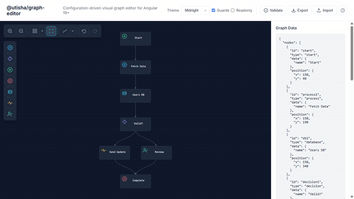

# @utisha/graph-editor

[](https://www.npmjs.com/package/@utisha/graph-editor)
[](https://github.com/fidesit/graph-editor/actions/workflows/ci.yml)
[](https://fidesit.github.io/graph-editor)
[](https://opensource.org/licenses/MIT)

A customizable, Angular-native graph editor for building workflow designers, data pipelines, and node-based UIs.
Built with **Signals**. Zero RxJS. One component. Full control.

*Build workflow editors, approval flows, state machines, ERD diagrams, org charts, and more.*

**[Live Demo](https://fidesit.github.io/graph-editor)** · **[StackBlitz](https://stackblitz.com/github/fidesit/graph-editor)** · **[API Docs](docs/API.md)**

<p align="center">
  
</p>

<p align="center">
  <em>Drag-to-connect, auto-layout, lifecycle guards with toast feedback, and 4 built-in theme presets.</em>
</p>

<p align="center">
  
</p>

<p align="center">
  <em>Corporate · Emerald · Blueprint · Midnight — or bring your own theme.</em>
</p>

---

## Why @utisha/graph-editor?

| | |
|---|---|
| **Angular-native** | Built for Angular 19+ with Signals and standalone components — not a React wrapper |
| **Single component** | Drop in `<graph-editor>` with a config object. No services, no modules, no boilerplate |
| **Config-driven** | Declare node types, edges, canvas, and theme — get a full-featured editor |
| **SVG rendering** | Crisp at any zoom level. No Canvas API, no WebGL |
| **Lightweight** | Only Angular + dagre. No heavyweight dependencies |

---

## Features

### Core Editing
- **Drag-to-connect** — Reveal ports on hover, drag to create edges
- **Multi-selection** — Box select (Shift+drag) or Ctrl+Click
- **Copy / Paste / Cut** — Ctrl+C/V/X with offset pasting
- **Undo / Redo** — Full history with Ctrl+Z / Ctrl+Y
- **Node resize** — Drag corner handles
- **Edge waypoints** — Ctrl+click to add manual routing bends
- **Arrow key nudge** — Move selected nodes 1px (Shift: 10px)

### Visual Customization
- **4 theme presets** — Corporate, Emerald, Blueprint, Midnight
- **Full ThemeConfig** — Canvas, nodes, edges, ports, selection, fonts, toolbar ([7 sub-interfaces](docs/API.md#theming))
- **CSS custom properties** — Override with `--graph-editor-*` variables
- **Custom SVG icons** — Define icon sets matching your design system
- **Per-type node styles** — Different colors/borders per node type
- **3 edge path strategies** — Straight, bezier, and step routing

### Developer Experience
- **Lifecycle hooks** — `canConnect`, `beforeNodeAdd`, `beforeNodeRemove`, `beforeEdgeAdd`, `beforeEdgeRemove` with async support
- **Validation system** — Custom rules with error/warning severity
- **Template injection** — `ng-template` for custom node (HTML/SVG) and edge rendering
- **Full TypeScript** — Strict mode, exported interfaces for everything
- **Configurable toolbar** — Choose which buttons appear, or hide it entirely

### Layout & Navigation
- **Auto-layout** — Dagre hierarchical (TB/LR) and compact algorithms
- **Fit to screen** — One-click viewport reset
- **Zoom & pan** — Mouse wheel zoom, canvas drag
- **Grid snapping** — Optional snap-to-grid with configurable size
- **Snap alignment guides** — Visual guides when dragging near other nodes

---

## Quick Start

### 1. Install

```bash
npm install @utisha/graph-editor
```

### 2. Import and configure

```typescript
import { Component, signal } from '@angular/core';
import { GraphEditorComponent, Graph, GraphEditorConfig } from '@utisha/graph-editor';

@Component({
  selector: 'app-my-editor',
  standalone: true,
  imports: [GraphEditorComponent],
  template: `
    <graph-editor
      [config]="editorConfig"
      [graph]="currentGraph()"
      (graphChange)="onGraphChange($event)"
    />
  `
})
export class MyEditorComponent {
  editorConfig: GraphEditorConfig = {
    nodes: {
      types: [
        { type: 'process', label: 'Process', component: null, defaultData: { name: 'Process' }, size: { width: 180, height: 80 } },
        { type: 'decision', label: 'Decision', component: null, defaultData: { name: 'Decision' }, size: { width: 180, height: 80 } },
      ]
    },
    edges: { component: null, style: { stroke: '#94a3b8', strokeWidth: 2, markerEnd: 'arrow' } },
    canvas: {
      grid: { enabled: true, size: 20, snap: true },
      zoom: { enabled: true, min: 0.25, max: 2.0, wheelEnabled: true },
      pan: { enabled: true }
    },
    palette: { enabled: true, position: 'left' }
  };

  currentGraph = signal<Graph>({
    nodes: [
      { id: '1', type: 'process', data: { name: 'Start' }, position: { x: 100, y: 100 } },
      { id: '2', type: 'decision', data: { name: 'Check' }, position: { x: 300, y: 100 } }
    ],
    edges: [
      { id: 'e1', source: '1', target: '2' }
    ]
  });

  onGraphChange(graph: Graph) {
    this.currentGraph.set(graph);
  }
}
```

That's it. You have a working graph editor with drag-to-connect, auto-layout, undo/redo, and a node palette.

→ **[Full API reference](docs/API.md)** — Inputs, outputs, methods, theming, validation, lifecycle hooks

---

## Lifecycle Hooks

Intercept and cancel user-initiated mutations with sync and async hooks:

```typescript
const config: GraphEditorConfig = {
  // ...
  hooks: {
    canConnect: (source, target, graph) => {
      return source.nodeId !== target.nodeId; // no self-loops
    },
    beforeNodeRemove: async (nodes) => {
      return confirm(`Delete ${nodes.length} node(s)?`);
    },
    beforeEdgeAdd: (edge, graph) => {
      const outgoing = graph.edges.filter(e => e.source === edge.source).length;
      return outgoing < 3; // max 3 outgoing per node
    }
  }
};
```

`canConnect` is sync (called every mousemove). All `before*` hooks support `Promise<boolean>` for dialogs or server validation.

→ **[Full lifecycle hooks docs](docs/API.md#lifecycle-hooks)**

---

## Theming

Pass a `ThemeConfig` or use CSS custom properties:

```typescript
const config: GraphEditorConfig = {
  // ...
  theme: {
    canvas: { background: '#0f172a', gridType: 'dot', gridColor: '#1e293b' },
    node: { background: '#1e293b', borderColor: '#334155', labelColor: '#e2e8f0' },
    edge: { stroke: '#475569', pathType: 'bezier' },
  }
};
```

→ **[Full theming docs](docs/API.md#theming)**

---

## Development

```bash
git clone https://github.com/fidesit/graph-editor.git
cd graph-editor
npm install
npm run start     # Demo on localhost:4200
npm test          # Karma + ChromeHeadless
npm run build     # Build library to dist/
```

## Roadmap

### Planned

- [ ] **Edge labels** — Clickable, editable text on edges
- [ ] **Group/collapse** — Collapsible container nodes
- [ ] **Minimap** — Overview panel with viewport indicator
- [ ] **Export as image** — SVG/PNG export
- [ ] **Search/filter** — Ctrl+F to find nodes by label/type
- [ ] **Swim lanes** — Horizontal/vertical partitions
- [ ] **Touch/mobile** — Pinch-to-zoom, touch drag
- [ ] **Edge animation** — Animated dashes for data flow visualization

### Shipped

Lifecycle hooks · Edge waypoints · Edge path switcher · Copy/paste/cut · Snap guides · Drag-to-connect · Multiple anchor points · Undo/redo · Multi-select · Node resize · Text wrapping · Custom rendering (templates + components) · Full theming system · Custom SVG icons · Validation system · Auto-layout (dagre + compact) · Configurable toolbar & palette

## Contributing

Contributions are welcome! Please read our [Contributing Guide](CONTRIBUTING.md) for details.

## License

[MIT](LICENSE) © Utisha / Fides IT
