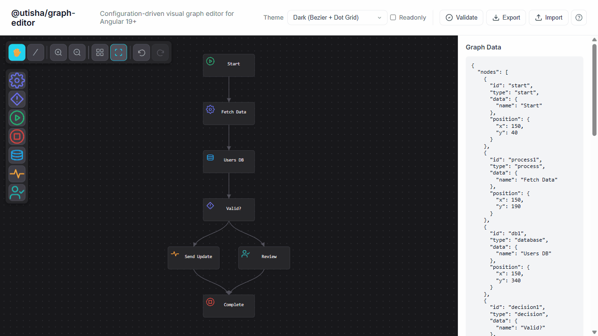
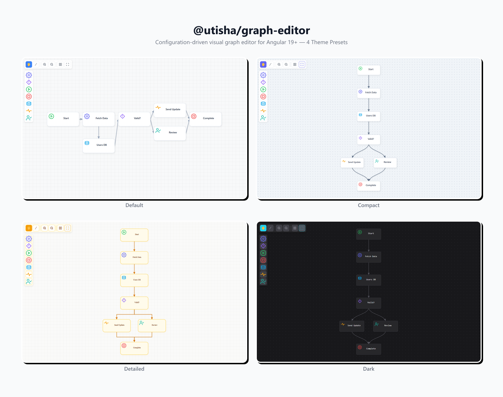

# @utisha/graph-editor

[](https://www.npmjs.com/package/@utisha/graph-editor)
[](https://github.com/fidesit/graph-editor/actions/workflows/ci.yml)
[](https://fidesit.github.io/graph-editor)
[](https://opensource.org/licenses/MIT)
[](https://stackblitz.com/github/fidesit/graph-editor)

Configuration-driven visual graph editor for Angular 19+.

**[Live Demo](https://fidesit.github.io/graph-editor)** | **[Try on StackBlitz](https://stackblitz.com/github/fidesit/graph-editor)**





## Features

- ⚙️ **Configuration-driven** — No hardcoded domain logic
- 🎯 **Type-safe** — Full TypeScript support with strict mode
- 🎭 **Themeable** — Full theme config (canvas, nodes, edges, ports, selection, fonts, toolbar) + CSS custom properties
- ⌨️ **Keyboard shortcuts** — Delete, arrow keys, escape, undo/redo
- 📦 **Lightweight** — Only Angular + dagre dependencies
- 🔌 **Framework-agnostic data** — Works with any backend/state management
- 🖼️ **Custom node images** — Use images instead of emoji icons
- 🎨 **Custom SVG icons** — Define your own icon sets with `iconSvg` property
- ⬜ **Multi-selection** — Box select (Shift+drag) or Ctrl+Click to select multiple items
- ↩️ **Undo/Redo** — Full history with Ctrl+Z / Ctrl+Y
- 🔲 **Node resize** — Drag corner handle to resize nodes (Hand tool)
- 📝 **Text wrapping** — Labels wrap and auto-size to fit within node bounds
- 🛠️ **Built-in toolbar** — Tools, zoom controls, layout actions in top bar; node palette on left
- 🧩 **Custom rendering** — ng-template injection for nodes (HTML or SVG) and edges, plus `ngComponentOutlet` support
- 🔀 **Edge path strategies** — Straight, bezier, and step routing algorithms

## Installation

```bash
npm install @utisha/graph-editor
```

## Quick Start

### 1. Import the component

```typescript
import { Component, signal } from '@angular/core';
import { GraphEditorComponent, Graph, GraphEditorConfig } from '@utisha/graph-editor';

@Component({
  selector: 'app-my-editor',
  standalone: true,
  imports: [GraphEditorComponent],
  template: `
    <graph-editor
      [config]="editorConfig"
      [graph]="currentGraph()"
      (graphChange)="onGraphChange($event)"
    />
  `
})
export class MyEditorComponent {
  // See configuration below
}
```

### 2. Configure the editor

```typescript
editorConfig: GraphEditorConfig = {
  nodes: {
    types: [
      {
        type: 'process',
        label: 'Process',
        icon: '⚙️',
        component: null, // Uses default rendering, or provide your own component
        defaultData: { name: 'New Process' },
        size: { width: 180, height: 80 }
      },
      {
        type: 'decision',
        label: 'Decision',
        icon: '🔀',
        component: null,
        defaultData: { name: 'Decision' },
        size: { width: 180, height: 80 }
      }
    ]
  },
  edges: {
    component: null, // Uses default rendering
    style: {
      stroke: '#94a3b8',
      strokeWidth: 2,
      markerEnd: 'arrow'
    }
  },
  canvas: {
    grid: {
      enabled: true,
      size: 20,
      snap: true
    },
    zoom: {
      enabled: true,
      min: 0.25,
      max: 2.0,
      wheelEnabled: true
    },
    pan: {
      enabled: true
    }
  },
  palette: {
    enabled: true,
    position: 'left'
  }
};
```

### 3. Initialize your graph

```typescript
currentGraph = signal<Graph>({
  nodes: [
    { id: '1', type: 'process', data: { name: 'Start' }, position: { x: 100, y: 100 } },
    { id: '2', type: 'decision', data: { name: 'Check' }, position: { x: 300, y: 100 } }
  ],
  edges: [
    { id: 'e1', source: '1', target: '2' }
  ]
});

onGraphChange(graph: Graph): void {
  this.currentGraph.set(graph);
  // Save to backend, update state, etc.
}
```

## Configuration

### GraphEditorConfig

| Property | Type | Description |
|----------|------|-------------|
| `nodes` | `NodesConfig` | Node type definitions + icon position |
| `edges` | `EdgesConfig` | Edge configuration |
| `canvas` | `CanvasConfig` | Canvas behavior (grid, zoom, pan) |
| `validation` | `ValidationConfig` | Validation rules |
| `palette` | `PaletteConfig` | Node palette configuration |
| `layout` | `LayoutConfig` | Layout algorithm (dagre) |
| `theme` | `ThemeConfig` | Visual theme (shadows, CSS variables) |
| `toolbar` | `ToolbarConfig` | Top toolbar visibility and button selection |

### Node Type Definition

```typescript
interface NodeTypeDefinition {
  type: string;           // Unique identifier
  label?: string;         // Display name in palette
  icon?: string;          // Fallback icon (emoji or text)
  iconSvg?: SvgIconDefinition;  // Professional SVG icon (preferred)
  component: Type<any>;   // Angular component to render
  defaultData: Record<string, any>;
  size?: { width: number; height: number };
  ports?: PortConfig;     // Connection ports
  constraints?: NodeConstraints;
}
```

### Custom Node Images

Nodes can display custom images instead of emoji icons. Set `imageUrl` in `defaultData` or per-instance in `node.data['imageUrl']`:

```typescript
// In node type definition (applies to all nodes of this type)
{
  type: 'agent',
  label: 'AI Agent',
  icon: '🤖',  // Fallback if imageUrl fails to load
  component: null,
  defaultData: {
    name: 'Agent',
    imageUrl: '/assets/icons/agent.svg'  // Custom image URL
  }
}

// Or per-instance (overrides type default)
const node: GraphNode = {
  id: '1',
  type: 'agent',
  data: {
    name: 'Custom Agent',
    imageUrl: 'https://example.com/custom-icon.png'  // Instance-specific
  },
  position: { x: 100, y: 100 }
};
```

Supported formats: SVG, PNG, JPG, data URLs, or any valid image URL.

### Custom SVG Icons

Define your own SVG icons using the `SvgIconDefinition` interface. This allows you to use professional vector icons that match your design system:

```typescript
import { SvgIconDefinition, NodeTypeDefinition } from '@utisha/graph-editor';

// Define your icon set
const MY_ICONS: Record<string, SvgIconDefinition> = {
  process: {
    viewBox: '0 0 24 24',
    fill: 'none',
    stroke: '#6366f1',  // Your brand color
    strokeWidth: 1.75,
    path: `M12 15a3 3 0 1 0 0-6 3 3 0 0 0 0 6Z
           M19.4 15a1.65 1.65 0 0 0 .33 1.82l.06.06...`
  },
  decision: {
    viewBox: '0 0 24 24',
    fill: 'none',
    stroke: '#8b5cf6',
    strokeWidth: 1.75,
    path: `M12 3L21 12L12 21L3 12L12 3Z
           M12 8v4
           M12 16h.01`
  },
  start: {
    viewBox: '0 0 24 24',
    fill: 'none',
    stroke: '#22c55e',  // Semantic: green for start
    strokeWidth: 1.75,
    path: `M12 22c5.523 0 10-4.477 10-10S17.523 2 12 2...
           M10 8l6 4-6 4V8Z`
  }
};

// Use in node types
const nodeTypes: NodeTypeDefinition[] = [
  { type: 'process', label: 'Process', iconSvg: MY_ICONS.process, component: null, defaultData: { name: 'Process' } },
  { type: 'decision', label: 'Decision', iconSvg: MY_ICONS.decision, component: null, defaultData: { name: 'Decision' } },
  { type: 'start', label: 'Start', iconSvg: MY_ICONS.start, component: null, defaultData: { name: 'Start' } },
];
```

**Icon priority:** `node.data['imageUrl']` → `nodeType.iconSvg` → `nodeType.defaultData['imageUrl']` → `nodeType.icon` (emoji fallback)

### Canvas Configuration

```typescript
interface CanvasConfig {
  grid?: {
    enabled: boolean;
    size: number;      // Grid cell size in pixels
    snap: boolean;     // Snap nodes to grid
    color?: string;
  };
  zoom?: {
    enabled: boolean;
    min: number;       // Minimum zoom level
    max: number;       // Maximum zoom level
    step: number;      // Zoom increment
    wheelEnabled: boolean;
  };
  pan?: {
    enabled: boolean;
  };
}
```

## API

### Inputs

| Input | Type | Description |
|-------|------|-------------|
| `config` | `GraphEditorConfig` | Editor configuration (required) |
| `graph` | `Graph` | Current graph data |
| `readonly` | `boolean` | Disable editing |
| `visualizationMode` | `boolean` | Display only mode |

### Outputs

| Output | Type | Description |
|--------|------|-------------|
| `graphChange` | `EventEmitter<Graph>` | Emitted on any graph mutation |
| `nodeClick` | `EventEmitter<GraphNode>` | Node clicked |
| `nodeDoubleClick` | `EventEmitter<GraphNode>` | Node double-clicked |
| `edgeClick` | `EventEmitter<GraphEdge>` | Edge clicked |
| `edgeDoubleClick` | `EventEmitter<GraphEdge>` | Edge double-clicked |
| `selectionChange` | `EventEmitter<SelectionState>` | Selection changed |
| `validationChange` | `EventEmitter<ValidationResult>` | Validation state changed |
| `contextMenu` | `EventEmitter<ContextMenuEvent>` | Right-click on canvas/node/edge |

### Methods

```typescript
// Node operations
addNode(type: string, position?: Position): GraphNode;
removeNode(nodeId: string): void;
updateNode(nodeId: string, updates: Partial<GraphNode>): void;

// Selection
selectNode(nodeId: string | null): void;
selectEdge(edgeId: string | null): void;
clearSelection(): void;
getSelection(): SelectionState;

// Layout
applyLayout(direction?: 'TB' | 'LR'): Promise<void>;
fitToScreen(padding?: number): void;
zoomTo(level: number): void;

// Validation
validate(): ValidationResult;
```

## Theming

Customize the editor appearance using CSS custom properties:

```css
:root {
  --graph-editor-canvas-bg: #f8f9fa;
  --graph-editor-grid-color: #e0e0e0;
  --graph-editor-node-bg: #ffffff;
  --graph-editor-node-border: #cbd5e0;
  --graph-editor-node-selected: #3b82f6;
  --graph-editor-edge-stroke: #94a3b8;
  --graph-editor-edge-selected: #3b82f6;
}
```

## Validation

Add custom validation rules:

```typescript
const config: GraphEditorConfig = {
  // ...
  validation: {
    validateOnChange: true,
    validators: [
      {
        id: 'no-orphans',
        message: 'All nodes must be connected',
        validator: (graph) => {
          const orphans = findOrphanNodes(graph);
          return orphans.map(node => ({
            rule: 'no-orphans',
            message: `Node "${node.data.name}" is not connected`,
            nodeId: node.id,
            severity: 'warning'
          }));
        }
      }
    ]
  }
};
```

## Development

```bash
# Clone the repository
git clone https://github.com/fidesit/graph-editor.git
cd graph-editor

# Install dependencies
npm install

# Build the library
npm run build

# Run the demo app
npm run start

# Run tests
npm test
```

## Roadmap

### Completed

- [x] ~~Custom node components via `foreignObject`~~ — Template injection + `ngComponentOutlet`
- [x] ~~Context menus~~ — Event emits on right-click (see demo for example UI)
- [x] ~~Multi-select~~ — Box selection (Shift+drag) and Ctrl+Click toggle
- [x] ~~Keyboard shortcuts~~ — Delete, arrows, Escape, Undo/Redo
- [x] ~~Undo/Redo~~ — Ctrl+Z / Ctrl+Y with full history
- [x] ~~Custom node images~~ — Use `imageUrl` in node data
- [x] ~~Custom SVG icons~~ — Define icons with `iconSvg` property
- [x] ~~Node resize~~ — Drag corner handle with Hand tool
- [x] ~~Text wrapping~~ — Labels wrap and auto-size within node bounds
- [x] ~~Comprehensive theming~~ — Full ThemeConfig with 7 sub-interfaces + CSS custom properties bridge

### Interaction & Editing

- [ ] Copy/paste — Ctrl+C/V to duplicate nodes (with offset) and their internal edges
- [ ] Snap guides — Alignment lines when dragging near another node's edge/center
- [ ] Edge labels — Clickable, editable text on edges (conditions, weights, transition names)
- [ ] Edge waypoints — Draggable midpoints on edges to create manual routing bends
- [ ] Drag-to-connect — Drag from a port directly to another node (instead of two-click line tool)
- [ ] Group/collapse — Select multiple nodes and group into a collapsible container node

### Navigation & Visualization

- [ ] Minimap — Small overview panel with viewport indicator
- [ ] Search/filter — Ctrl+F to find nodes by label/type, dim non-matching ones
- [ ] Heatmap overlay — Color nodes by a numeric metric using `overlayData`
- [ ] Edge animation — Animated dashes flowing along edges to show data direction/activity
- [ ] Zoom to selection — Double-click a node to zoom and center on it

### Data & Export

- [ ] Export as image — SVG/PNG export of the current canvas
- [ ] Import/export JSON — Toolbar button or API to serialize/deserialize the graph
- [ ] Clipboard integration — Paste graph JSON from clipboard to import subgraphs

### Validation & Feedback

- [ ] Port-based connections with type checking — Color-coded ports that only accept compatible connections
- [ ] Inline validation badges — Show error/warning icons directly on offending nodes
- [ ] Max connections indicator — Show remaining connection slots on ports

### Developer Experience

- [ ] Event hooks — `beforeNodeRemove`, `beforeEdgeAdd` etc. that can cancel operations
- [ ] Custom toolbar items — Inject custom buttons/components into the toolbar via template projection
- [ ] Readonly per-node — Lock individual nodes from editing while others remain editable
- [ ] Touch/mobile support — Pinch-to-zoom, touch drag, long-press for context menu
- [ ] Accessibility improvements

### Layout

- [ ] Multiple layout algorithms — Force-directed, circular, tree (not just dagre)
- [ ] Incremental layout — Re-layout only the neighborhood of a changed node
- [ ] Swim lanes — Horizontal/vertical partitions that nodes snap into

## Contributing

Contributions are welcome! Please read our [Contributing Guide](CONTRIBUTING.md) for details.

## License

[MIT](LICENSE) © Utisha / Fides IT
